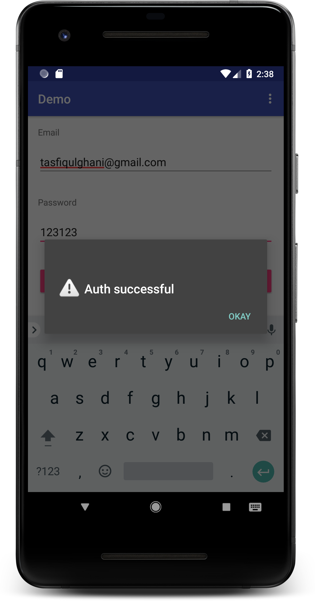

# AndroidWithNodeJsRestAPI

Android app with node js api to create an simple app to signup and login using MongoDB.Passwords are  encripted to ensure safety.Also JWT token system implemented.

###Features

- Rest API for simple Log In and sign up.
- Mongo DB database and aws server used .
- Express and mongoose used.
- bcrypt used for password encryption
- Jwt for access token.
- post methods for login and signup .

# NodeJs Code : https://github.com/TasfiqulGhani/AndroidWithNodeJsRestAPI
 

